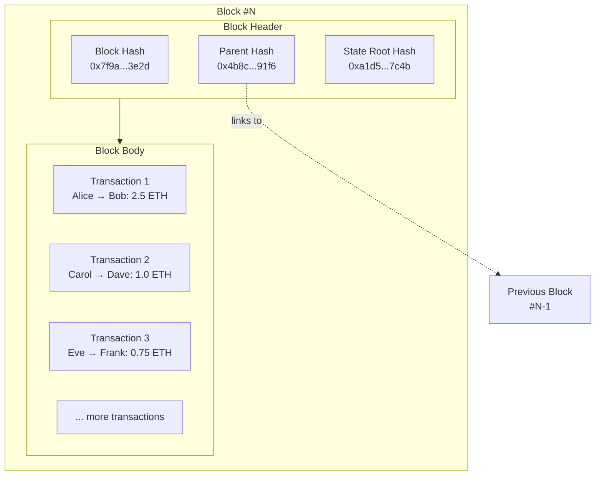

A collection a of [[Transaction]]s and a [[Block Header]], bundled together to be processed by the blockchain.

The summary of a block is as follows, in which: 
- [[State Root]] is a [[Commitment Hash]] to the [[State]] of the blockchain all the way from [[Genesis]] block up to block N.
- parent hash is linking this block to the previous one.
- Block body is a list of [[Transaction]]s. 

