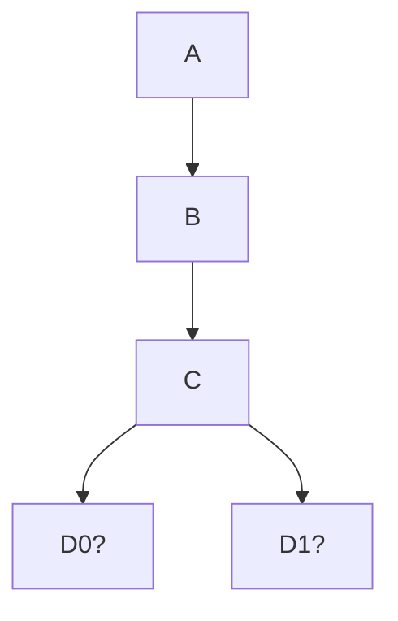

When a blockchain has multiple branches, also called "tips of the chain", and is not sure yet which one is the correct one: $D_0$ and $D_1$ below.

It could be possible that both $D_0$ and $D_1$ adhere to the correct [[STF]], but the [[Consensus Algorithm]] is yet to decide which one should be decided. It could also be that one of them is a different [[STF]].

The eventual correct fork is called the **canonical chain/fork**.

Forks are sometimes used to coordinate upgrades to the blockchain, as if the majority of the nodes upgrade to a different [[STF]], based on the rules of the [[Consensus Algorithm]], this new fork is now the canonical chain. See [[Evolution of Blockchain State Machines#Hard Forks]].

> If all nodes actually manage to upgrade at the same block, there will in fact be no fork.
