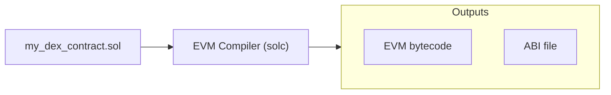

The most basic primitive that allow a blockchain based system to become programmable with arbitrary code from the users.

Smart contracts are written are written in different languages, and and once compiler, the output is the byte-code of a specific virtual machine that can the byte-code.

The most common language to write smart contracts is **Solidity**, invented by Ethereum, which compiles to EVM, Ethereum Virtual Machine.

Once uploaded to the blockchain (e.g. Ethereum), the public functions of the smart contract can be invoked by anyone who wants to interact with the contract. 

Most smart contract compilers, other than outputting the byte-code, also output a file that helps applications and users know what public functions are available in this smart contract, and what inputs should be given to each. In Solidity, this is called the **ABI**. 

Smart contracts are in some sense _mini [[State Machine]]s_. They have their own:
- Code; the contract code uploaded by some user. It has specified entry-points that other users can call into via [[Transaction]]s.
- [[State]]; each contract has its own dedicated storage that remains private to the contract.
- An address, identifying where the contract is and how it can be found.
- Like any other address, the smart contract can hold some balance in the native token of the chain on which it lives.
