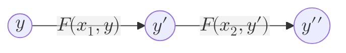

A model used in computer science to represent systems and applications. 

Blockchains can be modeled as a [[Trustless]] state-machine whereby the correct rule of a transition is defined as the **state transition function**, or **STF**.

One of the 3 main ways to model a blockchain, as explained in [[Blockchain Models]].

In the above, $y$,$y\prime$, and $y\prime\prime$ are different states. The whole state machine can at any point in time be in either of the states. $F$ is the state transition function and $x_1$ and $x_2$ are the inputs.

In our simple visualizations, the state machine seems to always go forward, but this is not necessarily the case. Normal state machines often involve loops. Even in a blockchain, when a [[Fork]] occurs and is eventually discarded, the blockchain state machine might revert back to a previous state.
