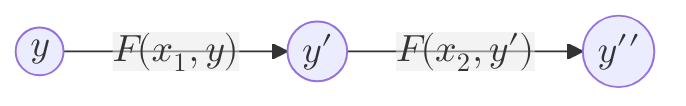

The rules through which a [[State Machine]] updates its state from one to another.



Looking at the different [[Blockchain Models]]:
- Blockchain as an Authority: The public rules that an authority declares it will abide by (e.g. a bank doing the calculation of money transfer and interest rate calculation correctly)
- Blockchain as a Computer: It is the code of the program that determines what will happen as inputs come in.

Finally, in actual blockchains, it boils down to this question: *Upon importing a new block into the blockchain, how will this block affect the state of the blockchain?*

In code terms, the STF can often be abstracted as:
```rust
/// Execute `block`, and return the the updates that should happen on the state,
/// represented as `StateUpdates`.
fn execute_block(block: Block) -> Result<StateUpdates, Error> { ... }
```
