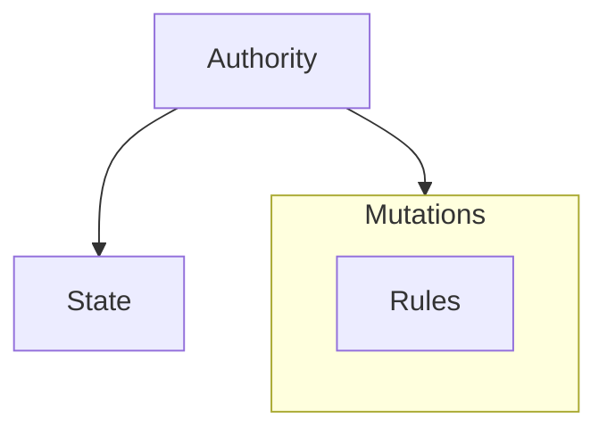
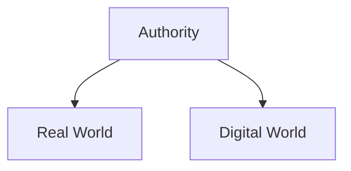
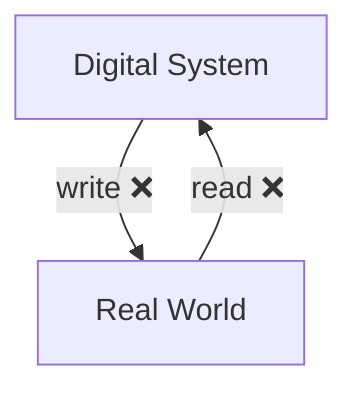

[[What Is This All About?]] introduced the idea of [[Trust]] and [[Authority]]. We described how Bitcoin creates a trustworthy digital bank, and how Ethereum is creating a trustworthy global computer that can perform general computations. Yet, we closed the chapter by acknowledging that there are limitations to this model. In this chapter, we will learn what those limitations are. But first, let's establish a mental model for how an [[Authority]] works.
## State and Mutation
Most authorities can be abstracted as two functions: they hold value-bearing and (often [[Blockchain and Contention|contentious]]) ***state*** (information), and they perform ***mutations*** (updates) upon that state based on a well-known set of **rules**.

In the example of Bitcoin, the **state** of the authority is the list of all accounts and their BTC balances, and the **mutations** are transfers of BTC between two accounts[^4]. The **rules** state that no one can spend more BTC than they own.
## Digital and Real-World
Another property of authorities is whether the state and its mutations are in the ***real world*** or the ***digital world***.

**Banking** (excluding cash) and many similar financial services in the modern day are examples of authorities that are purely **digital**. The state is a database holding everyone's balance, which is merely a set of numbers in a computer. Updating one's balance is as simple as updating one of these numbers.

Conversely, the **land registry** is a **real-world form of authority**. Such an authority needs to be able to know if a land exists, who owns it, and crucially, enforce the ownership of it through some law enforcement means, if need be.
### Oracle Problem
The often overlooked reality is: blockchains are *obviously* digital systems. **For a digital system, inspection of and updating the real world is (nearly) impossible to do *independently***. This difficulty, specifically when it comes to reading information from the real world, is referred to as the [[Oracle Problem]].

As an example, a digital system, such as a blockchain, has no practical way to *independently* understand if a piece of land exists, and to whom it belongs. Moreover, a digital system cannot meaningfully enforce that "*Alice should from now on own this land that formerly belonged to Bob*". Sure, the system can create a digital piece of data that says so, but so long as it is not enforced in the real world, it is meaningless.

This is why real-world authorities are backed by some form of ***law enforcement unit***, such as the police and military, as noted in [[What Is This All About?]]. No blockchain-based system yet has a real-world law enforcement body behind it[^1].

In contrast, blockchains can effortlessly be [[Trustless]] on use-cases whose state is purely digital. **This property demonstrates why Decentralized Finance ([[DeFi]] for short) is such a successful use-case for blockchains**. Assuming a free and open internet[^2], DeFi has no dependency on any real-world information.
### The Weakest Link
This is NOT to say that no blockchain-based system should attempt to tackle any real-world use-case. But we should acknowledge that there is a high chance of creating a system with a single point of failure here.

Very often, such systems combine a blockchain and its [[Trust#Science-based Trust|science-based trust]] with a human-based authority that conveys the existence of real-world information to and from the blockchain, and this human-based authority is exactly the single point of failure. This design might suffer from the [[Weakest Link]] issue.
### [[Trustless]]ness Can Be a Spectrum
Another, more open-minded way to look at the [[Weakest Link]] issue is that systems that have this weakest link (for example, tokenization of real-world assets on a blockchain) are not inheriting the full properties of a [[Trustless]] blockchain-based system, **but are rather selecting a subset of it**. And that is fine, as long as we are aware of it.

In the case of tokenization of real-world assets on a blockchain platform like Ethereum, the system **can simply not provide the verifiability** that a decentralized exchange between ETH and BTC has. This is because of the [[Oracle Problem|oracle]] that needs to be trusted to bridge these real-world assets to the blockchain. But it still benefits from the ***partial** verifiability*, *accessibility*, and *auditability* that a [[Trustless]] system provides.

> [!tip] Opinion
> What I often dislike is that this weakness is not acknowledged in all the hype-driven marketing material of such projects. I would run away from teams, founders, and companies that are operating on a system that has [[Oracle Problem|Oracles]] as a [[Weakest Link|weakest link]], but fail to articulate it.
## Summary
Any [[Authority]]'s role is to establish [[Trust]]. Blockchains are systems that yield [[Trust#Science-based Trust|science-based trust]], which is paradoxically called [[Trustless]], because it is free of [[Trust#Human-based Trust|human-based trust]]. An authority typically needs to hold some (contentious) **state** and perform **mutations** on top of it based on a clear set of **rules**. This state is either in the **real world** or the **digital world**.

Digital state is a great fit for blockchains, since it can be easily mutated by the same system. Real-world matters are more difficult, due to the [[Oracle Problem]], but it can be done. At the end of the day, the [[Trustless]]ness of Ethereum managing the transfer of the ETH token (a purely digital contentious state that it can fully read and write) is fundamentally different from an Ethereum [[Smart Contract]] managing tokenized real-world assets.

While we can strive to solve the [[Oracle Problem]] in a [[Trustless]] manner, turning a blind eye to it is defying the whole purpose of why the [[Web3]] industry exists, and why it managed to attract so many early adopters.

In the next chapter, [[Execution, Ordering and History]], we build on top of the three properties of blockchains that we know about:
- State
- Mutations + rules of mutations
and present more concrete mental models for blockchains.

[^1]: [The Network State](https://thenetworkstate.com/) book proposes steps through which digital authorities can evolve into gaining legitimacy in the real world, which is very much related to the enforcement issues mentioned above.
[^2]: How accurate is this assumption of the internet being "free and open"? See [[The Free Internet|here]].
[^4]: With some simplification, Bitcoin actually doesn't use an account model but rather a [UTXO](https://en.wikipedia.org/wiki/Unspent_transaction_output) system.
