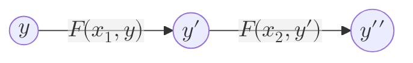

[[What Is This All About?]] and [[Blockchain-based Authorities]] were in very abstract terms; we called blockchains digital a [[Authority]] without much detail into how they actually work. Into the next chapters, we take steps towards making this more concrete. Specifically:
- [[Execution, Ordering, History and State Machines|This]] chapter will provide multiple more concrete mental models about blockchains
- [[Blocks, Transactions, And Blockchain Systems]] will then translate these mental models into exact blockchain terminology. 
- And [[Blockchain Networks]] shows how blockchains operate at a networks level.
## Verifiable Execution Of Rules
Recall that so far we modeled authorities down to 3 components:
- **State**
- **Mutation** of the state 
- **Rules** of the mutations. After all, to trust an [[Authority]], we need to have an expectation of what it would do
- And we should finally add that as users, we can interact with these authorities and *request* state mutations by providing **inputs** (instructions or messages) to the system.
 
Interestingly, this very much resembles what a computer program running on a hardware (like your laptop) does: 
- The **code** of the program defines the **rules**
- The code has access to a persistent **memory/storage** (**state**)
- Execution of the code updates the memory (**mutations**)
	- Execution of the code may receive some user **input** to its execution

Another mathematical representation of this would be $F(x, y) \rightarrow y\prime$. 
- $F$ is the **rule** of the system, the program's **code**
- $y$ is the current **state** of the program or **input memory**
- $x$ is the **user-input**
- $y\prime$ is the outcome of the mutation or **output memory**

> For example, $F$ is the function that determines the rule of transfer of value in a digital bank, $x$ is a transfer instruction, $y$ is the current balance of all users, and $y\prime$ is the balance of all users after the transfer $x$ is done.

Then, you and I want to execute $F$ to perform a transfer, and agree upon a $y\prime$. Neither you nor I trust one another, and we need an [[Authority]] to execute $F$ for us. We can either delegate this to a bank with [[Trust#Human-based Trust|Human-based Trust]], or do the same transfer in the Bitcoin network using [[Trust#Science-based Trust|Science-based Trust]].

All that is said to imply: **The first and most important property of blockchain systems is that whatever their rules is, we can be sure that this rule is respected.** This is why the tile of this section is: **Verifiable Execution**. Taking this to the two analogies that we named above:
- If we see blockchains as computer programs, we can be sure that no matter what, they execute their **code** correctly.
- If we see blockchains as mathematical formulas, we can be sure that $F(x, y)$ is executed correctly and $y\prime$ is valid.

> [!tip]- What about me running an open source code on my server/machine, and letting you verify it however you want? 
> Yes, that would partially work too, but then we are faced with a number of other challenges. Suppose I am the untrusted party that you want to interact with. Even if I show you the source code of ($F$) of what I am about to execute on my machine, how would you my machine actually did that? Perhaps you want to re-execute the same thing in your computer. If you go down this rabbit hole and do it right, you end up re-inventing all of the core technological pieces of what a blockchain does, explained in this chapter and the next one. 
## Ordering 
Then, imagine we have two subsequent transfers, $x_1$ and $x_2$: 
- $F(x_1, y) \rightarrow y_1$ 
- $F(x_2, y) \rightarrow y_2$ 
And in both, $F$ is executed correctly. 

But, we still need to decide *whether $x_1$ happened first or $x_2$*. Imagine Alice has 10 dollars. $x_1$ is meant to credit 5 to Alice, and $x_2$ is meant to debit 12 from her. The second transfer is successful IFF $x_1$ happens before $x_2$, but not the other way.

So, we need to establish an order for $x_1$ and $x_2$: 
- $F(x_1, y) \rightarrow y_1$ , and then $F(x_2, y_1) \rightarrow y_{12}$  or
- $F(x_2, y) \rightarrow y_2$ , and then $F(x_1, y_2) \rightarrow y_{21}$ 

This is when we realize that a blockchain has to **not only execute its said code/rules**, but also has to **determine the correct order of inputs**. Without going into how this is achieved, you can take for granted for now that blockchains do solve this problem by establishing a correct order of events. This is often called the **canonical** order. 

> In the blockchain terminology, this situation above is called a [[Fork]]: two competing outcomes, fighting to be established as the canonical one.

## Auditing
But is this enough? Yes and no. 

Suppose we are given the current state of the system, after $n$ mutations, $y_{n+1}$. Without any further means, we would have to trust that $F(x_0, y)$ all the way up until $F(x_n, y)$ has been executed correctly. 

One great additional property of [[Trust#Science-based Trust|Science-based Trust]] is that, because it is based on rules of math and science, it is **easily auditable**. As in, given the public and permissionless rules of the system, one can easily re-execute $F(x_0, y_0)$ all the way up to $F(x_n, y_n)$, and come to the conclusion that $y_{n+1}$ was indeed correct for themselves.

So, the third property of a blockchain based system is that **the entire history is auditable**.
### Genesis And Syncing
This is why in blockchain systems the notion of a **genesis data** and **syncing** is very prominent. We often hear the phrase "you can sync the blockchain". This means, given the initial state of the system, which is called the "genesis state" ($y_0$), and the known rule of the blockchain, $F$, and the history of all of the inputs ($[x_0, x_1, ..., x_n]$) you can always re-execute (*audit*) the entire history by executing $F(x_0, y_0)$ all the way up to $F(x_n, y_n)$.  

In other words, knowing: 
- $F$
- $y_0$
- $[x_0, x_1, ..., x_n]$

You can always re-execute the whole sequence of mutations to reach any final state $y_{n+1}$:
-  $F(x_0, y_0)\rightarrow y_1$
- $F(x_1, y_1)\rightarrow y_2$
- ...
- $F(x_{n}, y_{n})\rightarrow y_{n+1}$

This is why it is important for all blockchain systems to retain their history of user inputs ($[x_0, x_1, ..., x_n]$) as well[^2]

Note that this is not always possible in the [[Trust#Human-based Trust|Human-based Trust]]. While audits and regulations are indeed a thing Human-based authorities, they rely on further Human-based trust to be verified[^1]. Moreover, very often the chain of trust is based on the assumed good intention of people, which can never be retroactively audited.
## State Machine
Finally, we can introduce another useful mental model for blockchains, similar to the mathematical function and computer program, a deterministic [state-machine](https://en.wikipedia.org/wiki/Finite-state_machine).

> ...a state machine is an abstract machine that **can be in exactly one of a finite number of states at any given time**. The state-machine can **change from one state to another** in response to some **inputs**; the change from one state to another is called a **transition**... $\delta$ is is the **state-transition function**.

So, to take our above example, $F(x, y) \rightarrow y\prime$, and model it as a state machine:
- $F$ is the [[State Transition Function]] or [[STF]].
- $y$ is the current state
- $x_1$ / $x_2$ are the *input* to the mutation
- $y\prime$ is the new state

## Summary 
This chapter was our first step towards a more concrete definition of blockchains. Within it, we modeled blockchains as a system that can do the following: 
- It is a **verifiable** computer that executes some code (its defined set of rules) correctly
- While doing so it maintains a **canonical order** of events
- It retains enough information for anyone to **re-audit the entire** history.

We also noted that instead of a computer, a [[State Machine]] analogy can be used. This in fact summarized our main 3 abstract mental models to think about blockchains, all 3 of which are listed in [[Blockchain Models]]. 

We will next take the last step towards a concrete definition of blockchains in [[Blocks, Transactions, And Blockchain Systems]]. 

[^1]: the phrase "*who polices the police?*" encapsulates well why auditing a human-based trust often relies on further human-based trust. 
[^2]: As we learn in the next chapter, this is equivalent to retaining a history of all [[Block]]s.
