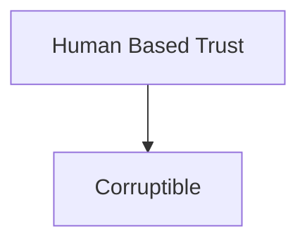
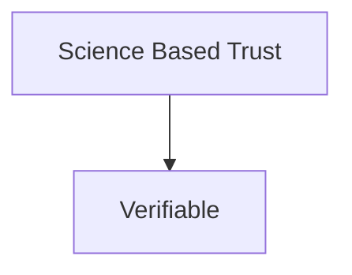
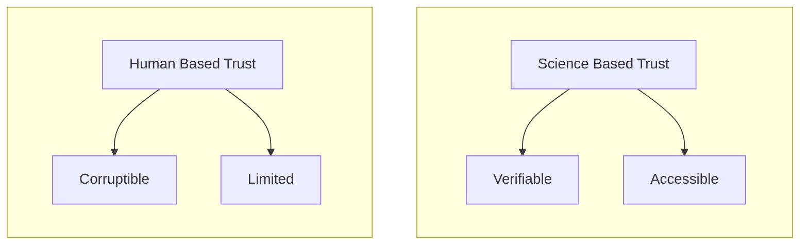
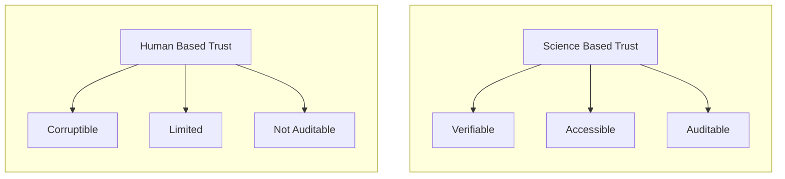

## Owning Digital Money 

To understand what Blockchains are about, let's dive right into the age-old example of owning digital money:
1. When you own $1000 in your bank
2. When you own $1000 in the Bitcoin network
How is it that we trust each of them to exist, and be credible? 
### Bank 
In the former, as little as one computer in the world, owned by the bank, can store the information that you own $1000. When you want to transact with your €1000, you need to authorize yourself to this one computer. 

And why do we trust that one computer that the bank holds? Probably something that we take for granted and don't bother too much with questioning. But, if you dig further, you will soon see that banks are trustworthy because they are backed by a central bank. Central banks are backed by government, and audited by regulators. Finally, governments have access to military, which is the ultimate reason we trust the system: **Law enforcements**.

![[What Is This All About? 2025-12-18-14.41.34.excalidraw]]

All such forms of trust have a critical property in common: They are based on humans acting based on a set of *rules*, not [hard-science](https://en.wikipedia.org/wiki/Hard_and_soft_science). And this entails:
- They are **corruptible**[^3][^4]: The human(s) in charge might decide to take a different action than what the rules expect them to do, or not do anything at all. This is especially self-evident in people in positions of power, because ["*absolute power corrupts absolutely*"](https://www.acton.org/research/lord-acton-quote-archive). 

We call these entities that we create, and then put our [[Trust]] into to let us transact on contentious matter, such as money, an [[Authority]]. A Bank is a societal authority that we [[Trust]] to handle ownership and transfer of money for us. Read more about this in [[Need For Trust]]. 
### Bitcoin
With the advent of Bitcoin, a number of thinkers started to imagine: How could we build a system that is *as trustworthy as the aforementioned*, yet its reasons for trust are rooted not in humans, but rather in hard-science, and well-understood laws thereof. Such trust would consequentially not be susceptible to any sort of **Corruption**. It would instead be: **Verifiable Trust**.

In the Bitcoin network, such branches of hard-science are most notably cryptography, economics, and distributed system. The main discovery of Bitcoin was that if one combines these branches of science together, they can build a system that is *equally trustworthy* of behaving according to certain rules, yet it requires no [[Trust]]-worthy human to sit in the center.

And the Bitcoin network is exactly one example of that: A simple bank, giving the ability to anyone to open an account in it, with basic rules that allow store/transfer of value, all without a human-based [[Authority]] to sitting in the middle.

> **Bitcoin's main novelty is demonstrating that creating an [[Authority]] with [[Trust#Science-based Trust|Science-based Trust]] is possible, and people are willing to store their wealth with this [[Authority]]**.

![[What Is This All About? 2025-12-18-15.07.59.excalidraw]]
### Cryptography and Military
One of the pillars of the traditional banking system is for you to visit a branch, provide some documents and a signature, and sign up for an account. Perhaps you would also provide a password in person, which you can later use with a card to authenticate yourself. This process is human-based, and works most of the time, but we can be sure that there have been cases of impersonation in a branch of a bank. Yet, thanks to the existence of trustworthy law enforcement in our society, we are okay with this system.

Contrary, in the Bitcoin network, public-key cryptography is used to authenticate users. This is a very well known method[^1] to allow one to digitally sign information and attest to the ownership of a key. 

Public key cryptography *doesn't work because an employee at a bank branch does their job correctly. It doesn't work because a said country has a very powerful central bank, regulatory bodies, and law enforcement*. **It works because of hard-science determining it works, no matter who or where you are and with whom you are interacting**. This crucially removes the need for a law enforcement from the [[Authority]] of Bitcoin.
### Commoditization 
Establishing a bank and a currency is not something that I can go on and do by myself. The nature of [[Trust#Human-based Trust|Human-based Trust]] trust is that it is not *accessible* to all. This is no fault of any particular person, but rather the *inherent property* of this type of [[Trust]]. A strong array of regulatory and law enforcement apparatus is needed to ensure the correctness of an [[Authority]] relying on [[Trust#Human-based Trust|Human-based Trust]], and therefore it is not very accessible.

Contrary, [[Trust#Science-based Trust|Science-based Trust]] requires little to no overhead to ensure its correctness, and therefore can be established by *significantly more people*, if not by *anyone*.

This is exactly a step towards a process known as [[Commoditization]]: A product, once seen special, becoming more and more accessible to the public. 20 years ago, to start a casino or to launch an IPO was a complicated, highly regulated process. Today, almost anyone can launch a token using Blockchain-based technologies, or start their (mini) casino by launching a smart contract or a meme-coin. [Decentralized Exchanges](https://en.wikipedia.org/wiki/Decentralized_finance) can allow this new token to be traded with other value-bearing tokens, organically determining its price in the open market. 

Therefore, we can add a new property to each category of [[Trust]]: Accessibility.

## Contention
Before we conclude this chapter, it is crucial to reflect on what the word [[Authority]] implies: Blockchains are means to create digital authorities, and authorities are meaningful when there is contention involved. That is, the matter at hand has a value-bearing aspect to it, and therefore individuals won't trust each other directly and need an authority to begin with. See more in [[Blockchain and Contention]].

## Summary 
This is really what blockchain-based technology is all about: Commoditizing the ability to establish an [[Authority]] and embed [[Trust]] in them, with superior properties of [[Trust#Science-based Trust|Science-based Trust]], compared to that of the [[Trust#Human-based Trust|Human-based Trust]].

Human-based trust is corruptible, and limited. Science-based trust, such as that of Bitcoin, is verifiable and accessible. 

> There is a third property, that [[Trust#Science-based Trust]] is often **auditable**, at least in the way implemented in blockchains. More in [[Execution, Ordering, History and State Machines]]. 

We summarize these properties that blockchain systems bring about as [[Trustless]]. Blockchains are a way to establish [[Trust]] without needing to trust a human or an entity controlled by humans anywhere, ergo Trust-*less*. When we take these properties and apply them to the Web, we then call that [[Web3]].

Bitcoin was the first demonstration that you can do this. It was the first digital bank, establishing [[Trust]] without a human-based [[Authority]]. This was the first step towards commoditization of digital money[^5].

Ethereum took the same idea to the next step and allowed more general forms of computation to be executed under the same [[Trustless]] manner. We explore this flexibility further in [[Evolution of Blockchain State Machines]]. 

One of the first demonstrated example of more general forms of computation was A standard like [ERC-20](https://ethereum.org/developers/docs/standards/tokens/erc-20/) on Ethereum, allowing anyone to create a token that is trade-able against ETH via Decentralized Exchanges. This was extensively used for fund-raising in the form of [ICO](https://en.wikipedia.org/wiki/Initial_coin_offering)s.

Don't be mistaken, **most of these ICO tokens ended-up being absolutely worthless**. But the crucial points is that the creation of them was no longer bottlenecked by the lack of trust. Their value converging to zero is not a a sign of any shortcoming in blockchain systems, but rather their advantage: Because *ANYONE* could now create a token, of course many of them ended up being worthless.  
## Next
Now, you might ask, can I use blockchains to establish trust in any scenario that requires trust? **Simple answer is: Not without some compromises**. Blockchains are end of the day digital systems, and can work with digital bits, just as a normal computer program do. In the next chapter, [[Blockchain-based Authorities]], we model an [[Authority]] further to look into why.

[^1]: It is not an overstatement to say public key cryptography is the backbone of the entire internet. Every time you open a website which uses HTTPS, this technology is used at least multiple times.
[^3]: As said by [Yuval Noah Harari in his famous TED talk](https://www.youtube.com/watch?v=nzj7Wg4DAbs), humanity's ability to establish such human-oriented institutions and giving them power is arguably the main reason of our advent, yet as we have seen in many anecdotes, it is also our Achilles hill: We are, not enlightened Elves, nor sturdy dwarfs, but rather greedy, corruptible humans. When given power, we sometimes but rush to abuse it.
[^4]: You can similarly see traces of this in the founding father's of America, trying to limit the amount of power given to the federal government. 